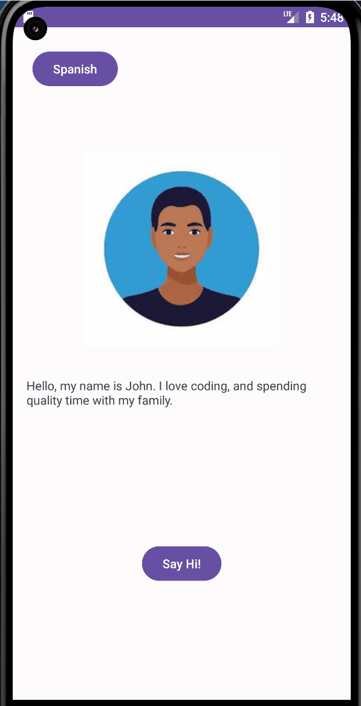

# Android Prework - *CodePath_Prework*

Submitted by: **Jonathan Alavez**

**CodePath_Prework** is an android app that shows an image and introductory message, and allows pressing a button to display a Toast. 

Time spent: **2** hours spent in total

## Required Features

The following **required** functionality is completed:

* [x] Image and introductory message displayed on screen
* [x] Button displayed on screen
* [x] Toast with message appears when button is pressed 

The following **optional** features are implemented:

* [x] Button(language) displayed on top left corner, displays Spanish or English
* [x] introductory message displays in Spanish when button is pressed, and displays back in English after pressing the button again
* [x] When language button is pressed, Toast message displayed will also be in the language that the button previously displayed.  
 

## Video Walkthrough

Here's a walkthrough of implemented features:

<!-- Replace this with whatever GIF tool you used! -->
GIF created with [ScreenToGif](https://www.screentogif.com/) 
<!-- Recommended tools:
[Kap](https://getkap.co/) for macOS
[ScreenToGif](https://www.screentogif.com/) for Windows
[peek](https://github.com/phw/peek) for Linux. -->

## Notes

Simple starter app to Android development.

## License

    Copyright [2024] [Jonathan Alavez]

    Licensed under the Apache License, Version 2.0 (the "License");
    you may not use this file except in compliance with the License.
    You may obtain a copy of the License at

        http://www.apache.org/licenses/LICENSE-2.0
